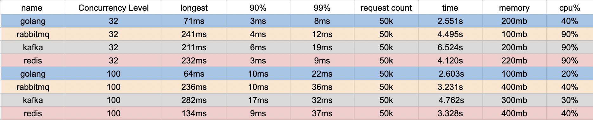

# pubsub
simple publisher / subscriber application with different methods


For start redis publisher server :
```
$ make serverRedis
```

For start redis subscriber server :
```
$ make serverSubscriberRedis
```
<br/>

For start kafka publisher server :
```
$ make serverKafka
```

For start kafka subscriber server :
```
$ make serverSubscriberKafka
```
<br/>

For start rabbitmq publisher server :
```
$ make serverRabbitmq
```

For start rabbitmq subscriber server :
```
$ make serverSubscriberRabbitmq
```
<br/>

For start go publisher and subscriber server :
```
$ make serverGo
```

<br/><br/>
benchmark GO redis kafka or rabbitmq:
```
 ab -k -p json.txt -T aplication/json -n 100000 -c 100 -t 1000  http://127.0.0.1:3000/pubsub-{YOUR-METHOD}}}/
```

<br/>
***results
<br/>



